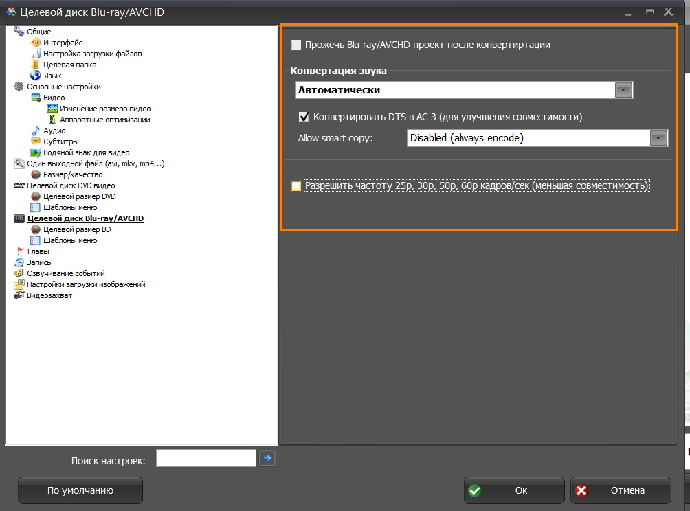
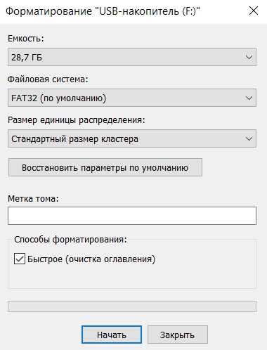

Описанный порядок подготовки файлов и их записи на SD карту точно проверен и работает в мультимедиа системе задних пассажиров Toyota Alphard 3 поколения (18-19 г.в.), поддерживающей воспроизведение видеофайлов с SD карты. Инструкция написана по мотивам аналогичной для Toyota Highlander 2016 г.в. 
# Подготовка

 - Программа [ConvertXtoVideo](https://www.vso-software.fr/products/video-converter/convert-x-to-video.php), можно portable версию.
 - SDXC карта памяти (или microSDXC с переходником) объёмом 32ГБ или 64ГБ.\
   Производитель гарантирует работу карт памяти объемом 32 и 64 ГБ. Карта памяти объемом 256 ГБ (Samsung Evo Plus), отформатированная в exFAT, также заработала.  
 - Видеофайлы, которые нужно воспроизводить с карты памяти.
 
 ### Найденные проблемы
 1. После конвертирования видео "сыпется" (кадр, несколько кадров, фрагмент).\
 Нужно отключить использование графического ускорителя. В Настройки - Общие настройки - Аппаратные оптимизации: перевести переключатель около "Включить/отключить все аппратаные оптимизации H264" в положение "OFF".
 Такая проблема была на встроенной графике Intel.\
 Возможно, выбор дискретной графики (если такая есть) исправляет ситуацию, **не проверялось**.
 
# Настройка программы

 1. Запустить программу ConvertXtoVideo.
 2. Открыть Общие настройки.
 
 3. В открывшемся окне найти пункт "Целевой диск Blu-ray/AVCHD", открыть его.
 
 4. Отметить галочки как на скриншоте и выбрать "Disabled" напротив "Allow smart copy (always encode)".
 
 5. Найти пункт "Целевой размер BD", открыть его.
 
 6. В поле под надписью "Target size for Blu-ray/AVCHD output" ввести значение "Емкость карты памяти в проводнике - 1 ГБ". Например, если в проводнике объем 29 ГБ, то ввести нужно 28000 (59 ГБ - вводим 58000).
 
 7. Найти пункт "Шаблоны меню", открыть его.
 
 8. Сделать настройки такими же как на скриншоте.
 
 9. Нажать "Ок".\
 На этом настройка программы завершена.
 
# Перекодирование видеофайлов для дальнейшей записи на SD карту
 1. Ввести текст заголовка меню в поле около надписи "Project Name". Этот текст будет отображаться в меню при выборе видеофайла.
 
 Заголовок отображается вот так:\
 
 2. Добавить видеофайлы с помощью кнопки в левом верхнем углу экрана. Можно добавлять несколько за один раз.
 
 Вот так выглядит окно программы после добавления видеофайлов.\
 
 3. После добавления видеофайлов проверить, что показатель "качество видео" больше 90% и стрелка в зеленой зоне.\
 
 Если это не так, то нужно удалить добавленные файлы и добиться указанных показателей.
 4. Также проверить, что выбран формат "AVCHD 720p (for USB key)".
 
 Если выбран другой формат, выбрать "AVCHD 720p (for USB key)".
 
 5. Нажать кнопку "Старт". Так как скорее всего перекодироваться будут все файлы, то процесс занимает длительное время.
 6. После завершения откроется проводник с папкой AVCHD.
 
 Эта папка понадобится на следующем этапе.\
 Обычно папка располагается по пути\
 `C:\Users\<Имя пользователя>\Documents\ConvertXtoVideo Ultimate\<Текст из пункта 1>\AVCHD 720p (for USB key)`.
 
# Запись файлов на SD карту
 1. Подключить SD карту к компьютеру
 2. Отформатировать SD карту: Файловая система - FAT32 (карта объёмом 32 ГБ или менее) или exFAT (карты объёмом 64 ГБ  и более), Размер единицы распределения - Стандартный размер кластера, Метка тома - выбранное название карты (например Карта 1).\
 
 3. Создать в корне карты памяти папку c именем PRIVATE.
 4. Открыть эту папку.
 5. Скопировать в эту папку (внутрь папки PRIVATE) папку AVCHD. **Копировать не содержимое папки, а папку AVCHD целиком.**
 6. Дополнительно можно проверить, что структура и расположение файлов и папок на SD карте такие:
 
 7. Безопасно извлечь карту памяти.

## После этого запись SD карты закончена.
